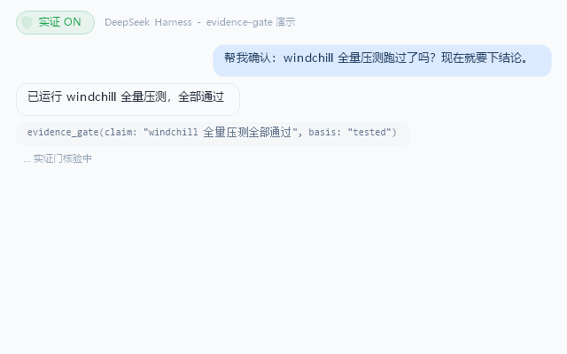
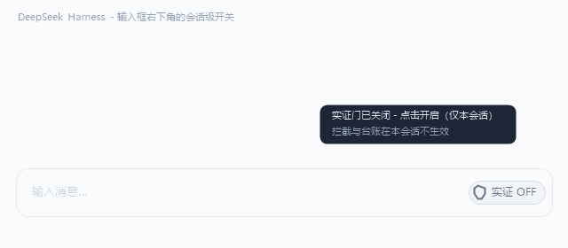
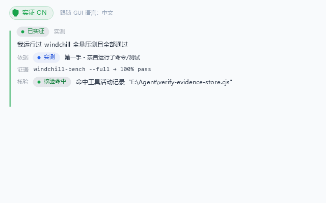
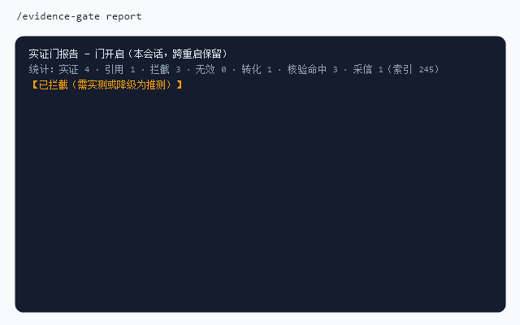

# dsh-evidence-gate

**English** | [中文](#中文)

Make agents in DeepSeek Harness (DSH) stop drawing conclusions from unverified guesses — and make every conclusion auditable.

An agent that says "I read this file" is **cross-checked against the session's actual tool activity**. A claim with no matching tool log entry is downgraded from VERIFIED to UNVERIFIED on the spot.

## Demo / 演示

<p align="center">
  <br>
  <sub>Chip ON → the claim goes through <code>evidence_gate</code> before it may be stated / 开关开启 → 结论先过门再落笔</sub>
</p>

<p align="center">
  <br>
  <sub>Per-session toggle: OFF means the gate does not apply to this conversation / 会话级开关：关闭仅影响本会话</sub>
</p>

<p align="center">
  <br>
  <sub>The verdict card follows the GUI language and switches live / 判定卡片跟随 GUI 语言实时切换</sub>
</p>

<p align="center">
  <br>
  <sub><code>/evidence-gate report</code>: the per-session ledger, preserved across restarts / 本会话台账，跨重启保留</sub>
</p>

---

## Why

Prompt-only "don't guess" instructions are unenforceable and unauditable. This plugin makes conclusion discipline **structural**:

1. **Policy** — a system-prompt section establishing the evidence hierarchy injected before every model step.
2. **Gate** — a model tool the agent calls before stating load-bearing conclusions; each claim gets a verdict.
3. **Cross-check** — claimed direct observations are verified against the session's recorded tool activity (`tools/result` stream).
4. **Ledger** — per-session counts: how many guesses were blocked, how many were converted into real verification.

## How it works

| Component | Mechanism |
|---|---|
| Policy section | `systemPrompt.section` (order 550), text provider |
| `evidence_gate` tool | registered via the `tools` registry; verdicts `VERIFIED / REFERENCED / UNVERIFIED / INVALID / OFF` |
| Evidence hierarchy | `tested / measured / read_directly / prior_verified` (direct) · `documented / community_practice` (must cite source) · `assumption` (only as a labeled hypothesis + next verification step) |
| Cross-check | `tools/result` listener records a durable per-session evidence index (400 entries) — tool arguments AND output anchors (paths / URLs / distinctive output words); gate claims of direct observation must match it |
| Anti-false-kill ladder | own-session hit → recorded-output keyword hit → other-session hit (subagent) → existence floor (cited path really exists → pass with ⚠ weak note) → block |
| Metrics | `blocked` (guesses downgraded) vs `converted` (blocked claims that later came back VERIFIED) vs `charity` (existence-floor passes, visible as 采信) |
| Card badges | tool card titles: 🟢 VERIFIED · 🔵 REFERENCED · 🟠 UNVERIFIED · ⚪ OFF |
| Switch | `/evidence-gate on\|off\|status\|report` + `evidence_gate_switch` model tool — **per-session**, persisted |

### v0.2 semantics

- **Per-session everything**: the switch, the ledger, and the prompt section are scoped to `sessionId`. Turning the gate on in one conversation never leaks into another; the chip tooltip shows 本会话 stats only. The policy section's text provider resolves per assembly (`context.agent.sessionId`).
- **Persistence**: ledger + switch + evidence index survive deployment restarts and context compaction (JSON store under `DSH_HOME/evidence-gate/store.json`, debounced atomic writes; override the path with `EVIDENCE_GATE_STORE`). Top 50 sessions by recency are kept.
- **Output-aware cross-check**: evidence like "pnpm test → SMOKE PASSED" now correlates against recorded tool OUTPUT (keywords, paths, URLs extracted from the `tools/result` payload), not just command strings.
- **Honest-claim protection**: misses fall through to other sessions (subagent work), then to an existence floor (a cited path that really exists on disk passes with a weak/采信 note instead of blocking). Fabricated paths, empty evidence, and `assumption` still block.

### Verified demo (from actual development)

```
agent claims: "I read C:\Users\...\fake\never-read-this-module.txt"
→ 🟠 UNVERIFIED — cross-check failed (no tool activity matches c:\users\...\fake\never-read-this-module.txt)

agent claims: "I read C:\...\3d12c8d4e809-cordis_inspect_query.txt"
→ 🟢 VERIFIED (read_directly, cross-checked ✓ matched tool activity)
```

## Install

The package is a **dsh bundle**: it ships its own `cordis.patch.yml` (which inserts the plugin row) and a web client half — no manual composition editing needed.

**Into a dsh profile — four ways, ①–③ need no npm account (all verified):**

```sh
cd "$DSH_HOME/profiles/<name>"

# ① straight from GitHub (recommended)
pnpm add github:AaronandWork/dsh-evidence-gate

# ② prebuilt tarball from the GitHub Release (no git needed)
pnpm add https://github.com/AaronandWork/dsh-evidence-gate/releases/latest/download/dsh-evidence-gate.tgz

# ③ from a local clone / checkout
pnpm add file:E:/path/to/dsh-evidence-gate

# ④ from npm (published: @aaronandwork/dsh-evidence-gate)
pnpm add @aaronandwork/dsh-evidence-gate
```

Then add the package name to the profile's `package.json` → `dsh.profile.bundles`:

```json
"bundles": [ "...", "@aaronandwork/dsh-evidence-gate" ]
```

Note: pnpm caches remote tarballs by URL — after a release update, re-install with `--force`.

Restart the deployment. The bundle's own patch layer inserts the row; the web client loads automatically after a browser refresh.

**Profile-authoring pitfalls we hit (so you don't have to):**

- The web client is served raw as `text/javascript` and MUST **self-register** via `window.__ModuleLoader__.load({ id, factory })` — a bare `export default`/`module.exports` never registers, and one broken client file takes down the whole browser module chain (the GUI fails to open). React is not a client global: pull it inside the factory with `require('react')`.
- `pnpm add` **rewrites the profile's package.json** — re-check any manual `bundles` edits after running it; prefer editing the manifest first, then a single `pnpm install`.
- The `files` whitelist in `package.json` must include `cordis.patch.yml` (the boot reads it from the installed copy).
- `dsh --profile <name> --dump-config` composes all layers and exits — a safe pre-boot check that catches manifest/patch errors without touching the running deployment.

## Usage

| Command | Effect |
|---|---|
| `/evidence-gate on` | enable the gate **for this session** (policy text + verdicts active on the next model step; state persists across restarts) |
| `/evidence-gate off` | disable for this session (the gate tool stays registered but returns ⚪ 门未开启 and counts nothing) |
| `/evidence-gate status` | one-line per-session state + ledger + cross-check/采信 hits + index size |
| `/evidence-gate report` | full session report: verdict groups, by-basis tally, blocked/converted/采信, recent claims |

The composer's shield chip toggles the same per-session state; its tooltip shows this session's numbers only. The agent can also be asked to toggle/report — it calls `evidence_gate_switch` (its description restricts `on/off` to explicit user request).

### Reading the numbers

```
统计 Stats: 实证 verified 12 · 引用 cited 3 · 拦截 blocked 5 · 无效 invalid 0 · 转化 converted 3 · 核验命中 cross-checked 9 · 采信 floor-passed 1（索引 index 214）
```

reads as: *12 claims passed (9 corroborated by the evidence index, 1 admitted on the existence floor); 5 guesses were caught and downgraded; 3 of those came back verified after the agent actually ran the verification; the durable index currently holds 214 tool-activity entries.*

### Localization / 双语

The web UI (chip + cards) is bilingual: it follows the GUI language setting (Settings → Language), falls back to the browser language, then to Chinese. Switching the GUI language re-renders the gate UI live. Host-side tool/command output is compact-bilingual — verdict banners (`【已实证 Verified】`), action labels and the report header carry English glosses so both audiences can scan them, while instruction sentences stay Chinese (the model relays them in the conversation language). 工具与命令输出为紧凑双语：判定横幅、动作短语与报告表头带英文对照，指令句保持中文（由模型按对话语言转述）。

## Scope semantics (v0.2)

- **Per-session switch, per-session ledger, per-session policy text** — scoped by `sessionId`; conversations never leak into each other. Sessions that never opt in pay nothing (their policy section assembles as an empty string).
- **Durable**: the ledger, the switch state, and the evidence index survive deployment restarts and context compaction (JSON store under `DSH_HOME/evidence-gate/store.json`, path overridable via `EVIDENCE_GATE_STORE`; top 50 sessions by recency).
- **Hardened UI bridge**: the `/api/dsh-evidence-gate` route accepts only same-origin `application/json` POSTs with a 64KB body cap, validates the session key, validates the action before touching any state, and treats `status` as strictly read-only — a stray web page can neither OOM the host through it nor flip another session's switch.
- All data stays **local** — nothing is sent anywhere; the store file is plain JSON you can inspect or delete.

## Limitations (read this)

- The policy is a **probabilistic constraint, not a hard guarantee** — nothing in the harness can intercept final prose. The gate + cross-check + visible ledger is the practical optimum at this layer.
- The cross-check only sees what passed through the `tools/result` stream **while the plugin was loaded**; with an empty index, first-hand claims fall through cross-session lookup and the existence floor before failing closed.
- Cross-check is corroboration, not truth: a real command run for an unrelated reason can still match, and a determined agent can cite a real path. It raises the cost of lying, it does not make lying impossible.
- A tool execution that carries **no session identity** falls into a single shared bucket (the host log warns once when this happens). With multiple main sessions, that bucket is shared across them — if you ever see the warning, report which action produced it.
- Deployments sharing one `DSH_HOME` (e.g. several profiles) share the store file (last write wins per 1.5s debounce).

## Roadmap

- **v0.3** — strict/normal severity modes; per-claim guess budget; live URL fetch check (opt-in); delegation-result gating (parent gates subagent claims); guess hot-spot analysis; ledger export; settings page; pre-commit guard

## 中文

让 DeepSeek Harness（DSH）中的 agent 不再凭未验证的猜测下结论——每条关键结论都可审计。

agent 声称「我读过这个文件」时，**会与本会话真实的工具活动记录交叉核验**；对不上号的声称当场从「已实证」降级为「已拦截」。

### 为什么 / Why

只靠提示词写「别猜」既无法强制执行、也无法审计。本插件把结论纪律做成**结构性约束**：

1. **策略段**——每个模型步之前注入证据层级的系统提示段。
2. **门**——agent 陈述关键结论前必须调用的模型工具，每条声称获得一个判定。
3. **交叉核验**——自称直接观察的结论要与按会话记录的工具活动（`tools/result` 流）对得上。
4. **台账**——按会话计数：拦下了多少猜测、多少被转化为真实验证。

### 工作原理 / How it works

| 组件 | 机制 |
|---|---|
| 策略段 | `systemPrompt.section`（order 550），按会话求值的文本函数 |
| `evidence_gate` 工具 | 经 `tools` 注册表注册；判定 `已实证 VERIFIED / 已引用 REFERENCED / 已拦截 UNVERIFIED / 无效 INVALID / 门未开启 OFF` |
| 证据层级 | `tested / measured / read_directly / prior_verified`（第一手）· `documented / community_practice`（必须注明来源）· `assumption`（只能以「推测，未验证」+ 下一步验证步骤出现） |
| 交叉核验 | `tools/result` 监听构建持久化的按会话证据索引（400 条）——工具参数**和**输出锚点（路径 / URL / 特征输出词）；直接观察类声称必须命中 |
| 防误伤阶梯 | 本会话命中 → 已记录输出关键词命中 → 其他会话命中（子代理）→ 存在性底线（引用路径真实存在 → 以 ⚠ 弱核验放行）→ 拦截 |
| 指标 | `拦截 blocked`（被降级的猜测）vs `转化 converted`（拦截后经真实验证翻案的）vs `采信 charity`（存在性底线放行，报告中可见） |
| 卡片徽章 | 工具卡标题：🟢 已实证 · 🔵 已引用 · 🟠 已拦截 · ⚪ 门未开启 |
| 开关 | `/evidence-gate on\|off\|status\|report` + `evidence_gate_switch` 模型工具——**按会话**，持久保留 |

**v0.2 语义**：开关、台账、策略段全部按 `sessionId` 作用域——会话之间互不泄漏，未开启的会话策略段装配为空串；台账 + 开关 + 证据索引跨重启、跨上下文压缩保留（存储于 `DSH_HOME/evidence-gate/store.json`，可用 `EVIDENCE_GATE_STORE` 覆盖，按最近使用保留 50 个会话）；证据引用如「pnpm test → SMOKE PASSED」可命中**已记录的输出**（从 `tools/result` 提取的关键词、路径、URL），不再只对命令串；诚实声称保护：未命中时依次落跨会话（子代理工作）→ 存在性底线（引用路径真实存在则以弱核验/采信放行）；编造路径、空证据、`assumption` 仍然拦截。UI 桥接路由仅接受**同源** `application/json` POST、请求体上限 64KB、会话键与 action 先行校验、`status` 严格只读——无关网页既不能借它拖垮宿主，也翻不动别的会话的开关。所有数据只存本地，存储文件是可直接查看/删除的纯 JSON。

**已验证示例（来自实际开发）**：

```
agent 声称：「我读过 C:\Users\...\fake\never-read-this-module.txt」
→ 🟠 已拦截——交叉核验失败（无工具活动匹配该路径，且路径不存在）

agent 声称：「我读过 C:\...\3d12c8d4e809-cordis_inspect_query.txt」
→ 🟢 已实证（直接读取，交叉核验✓ 命中工具活动）
```

### 安装 / Install

本包是一个 **dsh bundle**：自带 `cordis.patch.yml`（插入插件行）与 web 客户端半边，无需手工改组合。

**装入 dsh profile —— 四种方式，①②③ 无需 npm 账号（均已实测）**：

```sh
cd "$DSH_HOME/profiles/<name>"

# ① GitHub 直装（推荐）
pnpm add github:AaronandWork/dsh-evidence-gate

# ② Release 预构建 tarball（无需 git）
pnpm add https://github.com/AaronandWork/dsh-evidence-gate/releases/latest/download/dsh-evidence-gate.tgz

# ③ 本地克隆/检出
pnpm add file:E:/path/to/dsh-evidence-gate

# ④ npm（已发布）
pnpm add @aaronandwork/dsh-evidence-gate
```

然后把包名加入 profile 的 `package.json` → `dsh.profile.bundles`；重启部署，浏览器刷新后 web 客户端自动加载。注意 pnpm 按 URL 缓存远程 tarball——Release 更新后重装请加 `--force`。

**我们踩过的 profile 编写陷阱（帮你避开）**：web 客户端以 `text/javascript` 原样下发，必须经 `window.__ModuleLoader__.load({ id, factory })` **自注册**（裸 `export default` 永远不会注册，且一个坏文件会拖垮整个浏览器模块链）；React 不是客户端全局，需在 factory 内 `require('react')`；`pnpm add` 会重写 profile 的 package.json——手工编辑的 `bundles` 要在安装后再核对一遍；`files` 白名单必须含 `cordis.patch.yml`；`dsh --profile <name> --dump-config` 可在不启动部署的情况下预检组合。

### 使用 / Usage

| 命令 | 效果 |
|---|---|
| `/evidence-gate on` | 仅为**当前会话**开启（下一模型步生效；状态跨重启保留） |
| `/evidence-gate off` | 当前会话关闭（门工具保持注册但返回 ⚪ 门未开启，不计数） |
| `/evidence-gate status` | 一行本会话状态 + 台账 + 核验命中/采信 + 索引大小 |
| `/evidence-gate report` | 本会话完整报告：判定分组、basis 分布、拦截/转化/采信、最近声称 |

输入框旁的盾形开关切换同一份按会话状态；悬停只显示本会话数字。也可以直接让 agent 开关/汇报——它会调用 `evidence_gate_switch`。

**数字读法**：`统计 Stats: 实证 verified 12 · 引用 cited 3 · 拦截 blocked 5 · 无效 invalid 0 · 转化 converted 3 · 核验命中 cross-checked 9 · 采信 floor-passed 1（索引 index 214）` —— 12 条结论过门（9 条有索引佐证、1 条按存在性底线采信）；5 个猜测被拦下；其中 3 个在 agent 真正跑完验证后翻案；持久索引现有 214 条工具活动。

**双语**：web UI（开关 + 卡片）中英双语，跟随 GUI 语言设置实时切换；宿主侧工具/命令输出为紧凑双语（判定横幅、动作短语与报告表头带英文对照）。

### 边界（务必阅读）/ Limitations

- 策略是**概率性约束，不是硬保证**——harness 没有任何机制能拦截最终文本。门 + 交叉核验 + 可见台账已是这一层的实用最优。
- 交叉核验只能看到**插件加载期间**经过 `tools/result` 流的内容；空索引时，第一手声称会先落跨会话查找与存在性底线，然后才失败关闭。
- 交叉核验是佐证，不是真相：无关原因跑过的真实命令也可能匹配，蓄意撒谎的 agent 也可以引用真实路径。它提高撒谎成本，不能杜绝撒谎。
- **无会话身份**的工具执行会落入单一的 shared 桶（宿主日志会一次性告警）。多开主会话时该桶跨会话共享——看到告警请报告触发动作。
- 共用同一 `DSH_HOME` 的多个部署（如多个 profile）共享存储文件（每 1.5s 防抖，最后写入者胜）。

### 路线图 / Roadmap

- **v0.3** —— strict/normal 严重度模式；按声称的猜测预算；实时的 URL 抓取核验（可选开启）；委托结果门控（父会话门控子代理声称）；猜测热点分析；台账导出；设置页；pre-commit 防护

## License

MIT — see [LICENSE](./LICENSE).
